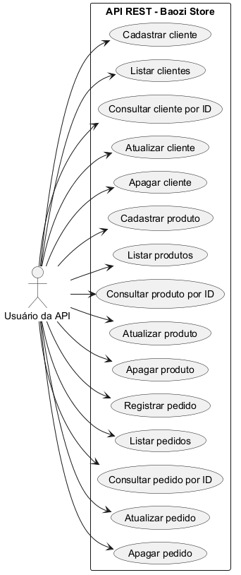

# TRABALHO DE DESENVOLVIMENTO WEB BACK-END

## API REST - Baozi Store

**Aluno:** Samuel Librelon Pinheiro Lopes  
**RU:** 4676351  
**Disciplina:** Desenvolvimento Web Back-End

## 1. Descrição da situação fictícia

A Baozi Store é uma pequena loja especializada na venda de pão chinês. Para melhorar a organização do negócio, foi desenvolvido um sistema simples para controlar clientes, produtos e pedidos.

O cliente **Samuel Librelon Pinheiro Lopes4676351** realizou seu cadastro no sistema em 23 de agosto de 2026. O produto vendido pela loja chama-se **Baozi de carne suína**, possui o preço unitário de **R$ 12,50** e está disponível em estoque.

Em determinado momento, o cliente realizou um pedido de **3 unidades** do produto. O sistema registrou o cliente, o produto comprado e a quantidade solicitada, facilitando o controle das operações da loja.

Os mesmos dados desta descrição foram utilizados nos testes realizados no Postman.

## 2. Diagrama de caso de uso

O ator principal é o **Usuário da API** e os casos de uso representam as operações de cadastrar, listar, consultar por ID, atualizar e apagar Cliente, Produto e Pedido.

## 3. Especificação da API desenvolvida

### 3.1 Entidade Cliente

| Campo | Tipo | Descrição |
|---|---|---|
| id | Long | Identificador gerado automaticamente |
| nome | String | Nome do cliente seguido do RU |
| clienteDesde | LocalDate | Data de cadastro do cliente |

Endpoints: `POST /clientes`, `GET /clientes`, `GET /clientes/{id}`, `PUT /clientes/{id}` e `DELETE /clientes/{id}`.

### 3.2 Entidade Produto

| Campo | Tipo | Descrição |
|---|---|---|
| id | Long | Identificador gerado automaticamente |
| nome | String | Nome do produto |
| preco | BigDecimal | Preço unitário |
| estoque | Boolean | Indica se o produto está em estoque |

Endpoints: `POST /produtos`, `GET /produtos`, `GET /produtos/{id}`, `PUT /produtos/{id}` e `DELETE /produtos/{id}`.

### 3.3 Entidade Pedido

| Campo | Tipo | Descrição |
|---|---|---|
| id | Long | Identificador gerado automaticamente |
| clienteId | Long | Identificador do cliente comprador |
| produtoId | Long | Identificador do produto comprado |
| quantidade | Integer | Quantidade de unidades compradas |

Endpoints: `POST /pedidos`, `GET /pedidos`, `GET /pedidos/{id}`, `PUT /pedidos/{id}` e `DELETE /pedidos/{id}`.

## 4. Tecnologias e arquitetura

O projeto foi desenvolvido com Java 17, Spring Boot 3.5.16, Spring Web, Spring Data JPA e banco relacional H2. Os endpoints recebem e retornam dados em JSON. O código está organizado nos packages `model`, `repository` e `controller`, seguindo a arquitetura MVC solicitada.

O banco H2 foi configurado para persistir os dados na pasta `data` do projeto. O console pode ser acessado em `http://localhost:8080/h2-console` com usuário `sa`, senha em branco e URL JDBC `jdbc:h2:file:./data/baozistore`.

## 5. Testes com Postman

### 5.1 Cadastros

- POST de Cliente.
- POST de Produto.
- POST de Pedido.

### 5.2 Listagens gerais

- GET geral de Clientes.
- GET geral de Produtos.
- GET geral de Pedidos.

### 5.3 Consultas por ID

- GET por ID de Cliente.
- GET por ID de Produto.
- GET por ID de Pedido.

### 5.4 Exclusões

- DELETE de Pedido.
- DELETE de Produto.
- DELETE de Cliente.

## 6. Repositório do projeto

**Link:** https://github.com/samuellibrelon/baozi-store-api-rest

## 7. Conclusão

O desenvolvimento da API permitiu aplicar os conceitos de API REST, arquitetura MVC, persistência de dados com Spring Data JPA e operações CRUD. A aplicação possibilita o cadastro e a consulta de clientes e produtos, além do registro de pedidos que relacionam um cliente a um produto e a uma quantidade comprada.
